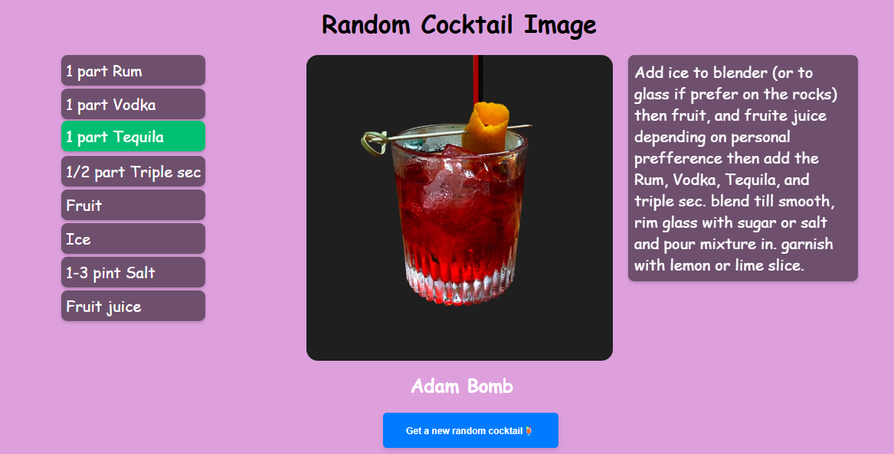

# random-cocktail
Es una aplicación interactiva diseñada para los entusiastas de la mixología que desean descubrir nuevas recetas de cócteles de forma rápida y fácil. La aplicación utiliza una API de cócteles para proporcionar información en tiempo real sobre una amplia variedad de bebidas, incluyendo ingredientes y métodos de preparación.

## API utilizada
Esta aplicación consume datos de la [TheCocktailDB API](https://www.thecocktaildb.com/), una base de datos abierta para cócteles y bebidas. A través de esta API, la aplicación obtiene los ingredientes, instrucciones y nombres de los cócteles mostrados.

## Capturas de Pantalla

## Características

- Recetas de cócteles al azar: Obtén una nueva receta de cóctel cada vez que cargues la página o  presiones un botón de refrescar. Perfecto para descubrir bebidas nuevas y variadas.
- Visualización de ingredientes: Muestra una lista detallada de ingredientes con medidas precisas, facilitando la preparación sin necesidad de hacer cálculos adicionales.
- Instrucciones claras: Instrucciones paso a paso para mezclar y preparar cada cóctel, ideal para usuarios de todos los niveles.
- Efecto visual y estilo interactivo: Efectos de hover y animaciones en los elementos clave de la aplicación, como la lista de ingredientes e instrucciones, que mejoran la experiencia de usuario.

## Tecnologías Utilizadas

- HTML5 11.4%
- Javascript 22.4%
- CSS 66.2%

## Licencia

Este proyecto está bajo la Licencia MIT. Consulta el archivo [LICENSE](LICENSE) para más detalles.

